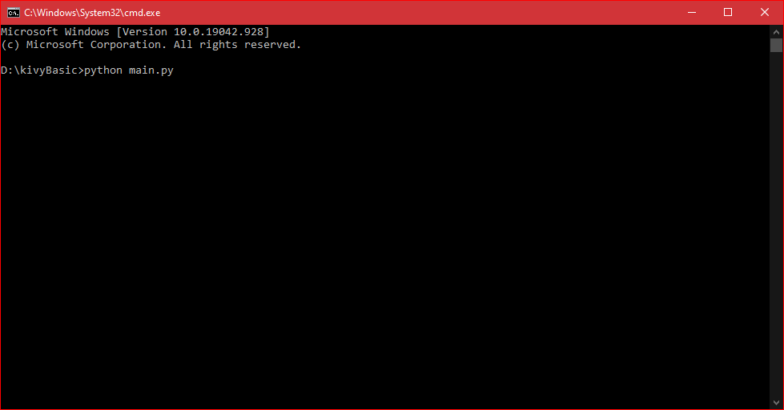

# Kivy Basics

### What is Kivy ?

> Kivy is an opensource multi-platform GUI development library for Python and can run on iOS, Android, Windows, OS X, and Linux. It helps develop applications that make use of innovative, multi-touch UI. The fundamental idea behind Kivy is to enable the developer to build an app once and use it across all devices, making the code reusable and deployable, allowing for quick and easy interaction design and rapid prototyping.

### Advantages
- Based on Python, which is the extremely powerful.

- Write code conce and use it across all devices.

- Performs better than HTML% cross-platform.

- Easy to use widgets and built with multi-touch support.

### Disadvantages
- Non-native looking User Interface.

- Bigger package size.

- Lack of community support.

- Lack of good examples and documentation.


## Installation in windows

> Step 1: Upgrade the pip

```python -m pip install --upgrade pip ```

> Step 2: Install the dependencies

```
python -m pip install docutils pygments pypiwin32 kivy.deps.sdl2 kivy.deps.glew
python -m pip install kivy.deps.gstreamer
python -m pip install kivy.deps.angle
```

> Step 3: Install kivy

```python -m pip install kivy```

** For other Operating Systems [Here](https://kivy.org/doc/stable/gettingstarted/installation.html#installation-canonical)**

### Create an application
There are three steps of creating an application with kivy:

1. Inherit Kivy's App class which represents the window for our widgets

2. Create a **build()** methods, which will show the content of the widgets.

3. At last calling of the **run()** method.


```
#Example

from kivy.app import App
from kivy.uix.button import Label

class HelloKivy(App):
    def build(self):
        return Label(text = 'Hello Geeks')

HelloKivy().run()
```

**Output**



